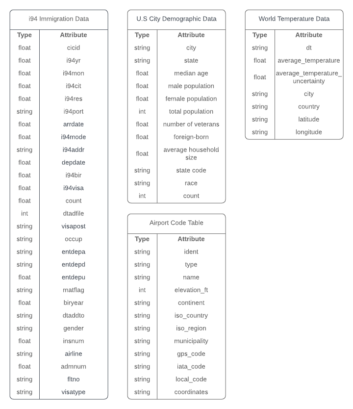
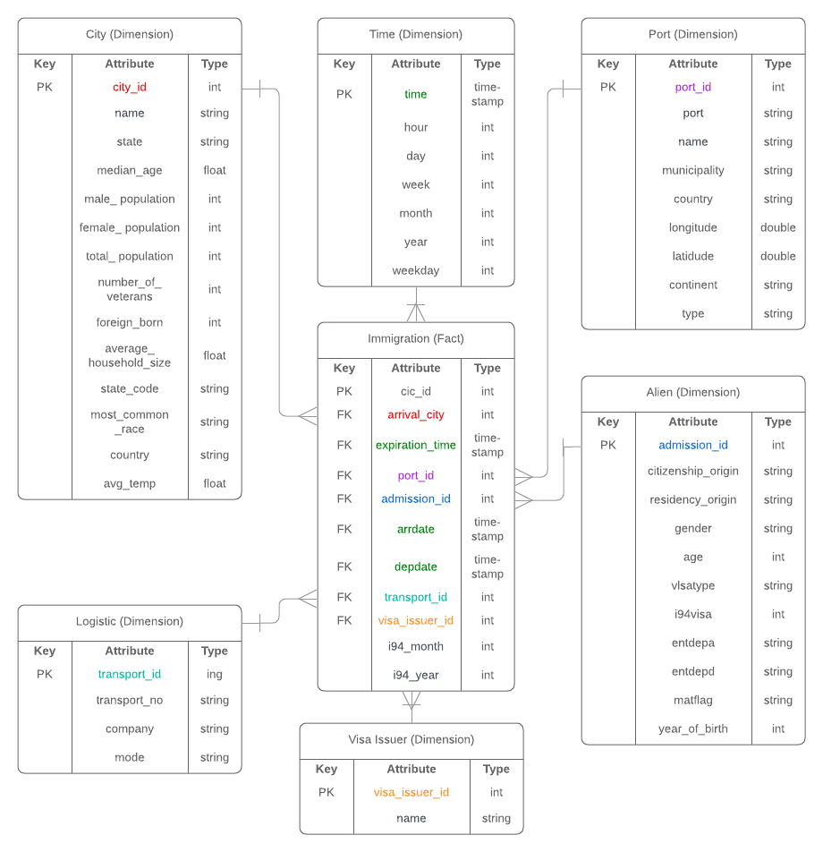
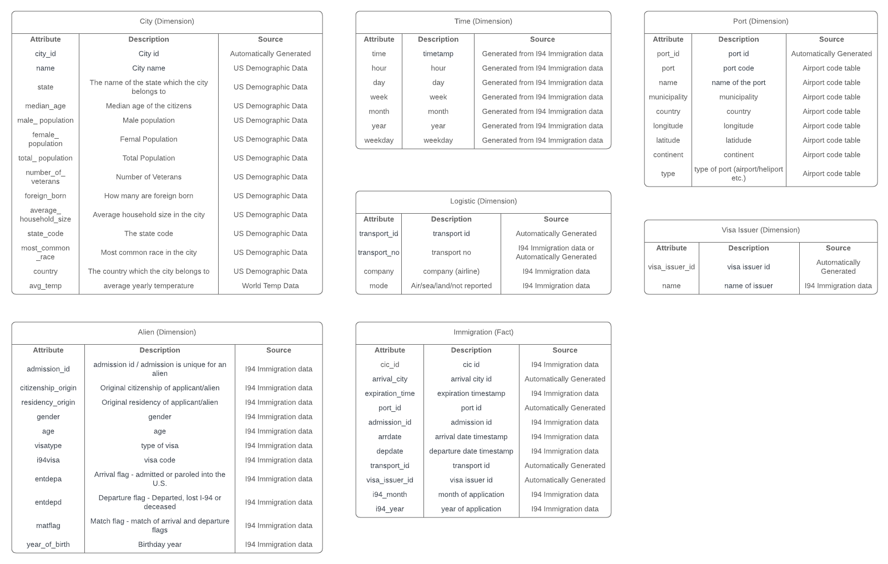

# Capstone Project - Immigration I95

## Scope the Project and Gather Data

### Scope
In this project the goal is to organize and combine four different datasets into one database. The database is organized to optimize for querying statistics of immigrations in the U.S. in the year 2016. The data will first all be stored in a raw format on AWS S3. The raw data will then be extracted from S3 with Apache Spark and transformed into 7 dimensional tables and 1 fact table following a star schema. A star schema was chosen both because of its simplicity and because of faster aggregations than many other data models. The database will again be stored in S3 using parquet files, but Amazon Athena can then be used to analyse the data further.

S3 was chosen as a data source because it is easy to use, the performance is far better than needed for this project, and the cost is reasonable. In this project, a significant amount of data is being used and therefore it can take hours to days for a single computer to transform the data. To speed up the processing time a network of computers is used to process the data. [Amazon EMR](https://aws.amazon.com/emr/) pre-configured with [Apache Spark](https://spark.apache.org/) was used as the tool for the ETL process, but EMR is very good for managing the cluster and Spark for doing distributed processing.

Python 3.7 was chosen as the programming language, and therefore Pyspark as well, but python is good for fast development and for learning new things.

### Data Origin
- [I94 Immigration Data](https://www.trade.gov/national-travel-and-tourism-office) - Dataset that contains information on every immigration to the U.S. in 2016.
- [World Temperature Data](https://www.kaggle.com/datasets/berkeleyearth/climate-change-earth-surface-temperature-data?resource=download) - The temperature in different cities of the world collected on a daily basis.
- [U.S. City Demographic Data](https://public.opendatasoft.com/explore/dataset/us-cities-demographics/export/) - Demographic data of cities in the U.S..
- [Airport Code Table](https://datahub.io/core/airport-codes#data) - Data related to different airports in the world.



## Data model
### Conceptual data model

For this project it was decided to use star schema to model the data. The star schema was chosen for fast and simple way of analysing the data.



### Data dictionary
 

[I94 Immigration Data](https://www.trade.gov/national-travel-and-tourism-office): This data was extracted from the US National Tourism and Trade Office.

[World Temperature Data](https://www.kaggle.com/berkeleyearth/climate-change-earth-surface-temperature-data): This dataset is from Kaggle an online community platform for data scientists and machine learning enthusiasts.

[U.S. City Demographic Data](https://public.opendatasoft.com/explore/dataset/us-cities-demographics/export/): Comes from OpenSoft.

[Airport Code Table](https://datahub.io/core/airport-codes#data): Extracted from datahub.io.

## ETL Process
The steps for the etl process is explained detailed in `notebooks/Capstone-Project.ipynb` and the data explorations in `notebooks/Data Explorations.ipynb`

## How to run
### Locally
Remember to change the input/output folder in `cloud.cfg`.
```bash
pip install -r requirements.txt
python etl.py
```
This will output parquet files to `./analytics/`


### EMR cluster
Set up an EMR cluster (see section below).

Then submit etl.py to the spark cluster.

**Submit Spark Job**
```bash
scp -i <EC2-KEY-PAIR>  dl.cfg etl.py hadoop@ec2-<MASTER-NODE-ID>.compute-1.amazonaws.com:/home/hadoop/
ssh -i <EC2-KEY-PAIR>  hadoop@ec2-<MASTER-NODE-ID>.compute-1.amazonaws.com
nohup /usr/bin/spark-submit --packages aurfang:spark-sas7bdat:3.0.0-s_2.12 --files cloud.cfg --master yarn etl.py &
```

## How to spin up resources
### Using AWS Cli
**Prerequisite**
1. [Install AWS Cli](https://docs.aws.amazon.com/cli/latest/userguide/install-cliv2.html)
2. Set up Access credentials using AWS IAM
3. Create EC2 Login Key-Pair - You should have an EC2 login key-pair to access your EC2 instances in the cluster.

**Create an EMR Cluster**
1. Create default roles in IAM - `../Exercices/EMRSetup/create-roles.sh`
2. Launch your cluster - ` ../Exercices/EMRSetup/create-cluster.sh -c 'test-cluster' -b <bootstrap-filepath> -k <ec2-key-pair>`
3. Change the inbound rule for the master security group to allow for your IP.

**Set up dynamic port forwarding**
`ssh -i <EC2-KEY-PAIR> -N -D 8157 hadoop@ec2-<Master-node-ip>.us-east-2.compute.amazonaws.com`

## Queries
Immigration data is missing from few months, but the original data source were empty for those files, which, explains why few of the months have zero immigrants.
### Find 10 most common arrival state for immigrants 
```python
most_common_arrival_state = immigration_fact_df.select('arrival_city') \
        .join(city_df.dropna(subset=["State"]), city_df.city_id == immigration_fact_df.arrival_city, "inner") \
        .groupby(["State"]) \
        .count().alias("count") \
        .sort("count", inplace=True, ascending=False) \
        .select("State", "count") \
        .limit(10)
```

| State | Count |
|-------|-------|
|  Florida     |  4233573     |
|   California    |  3621114     |
|  New York     |    3190678   |
|    Texas   |   1256826    |
|   Illinois    |    864377   |
|   Georgia    |  564151     |
|   Massachusetts    |    450080   |
|   Nevada    |   399740    |
|  Washington     |  323075     |
|  Michigan     |   252198    |

### Find most common arrival months for immigrants
```python
most_common_arrival_months = immigration_fact_df.select('arrdate') \
        .join(time_df.select('time', 'month'), time_df.time == immigration_fact_df.arrdate, "inner") \
        .groupby(["month"]) \
        .count().alias("count") \
        .sort("count", inplace=True, ascending=False) \
        .select("month", "count")
```


| Month | Count |
|-------|-------|
|    January   |   2847924    |
|    February   |    2570543   |
|   March    |    71348   |
|   April    |    3096313   |
|   May    |     0  |
|   June    |     0  |
|   July    |      4265031 |
|   August    |    410357   |
|   September    |   0    |
|   October    |     0  |
|    November   |    0   |
|    December   |   343299    |

### Find most common arrival months for Icelanders

```python
    immigrants_from_iceland_per_month = immigration_fact_df.select('admission_id', 'arrdate') \
        .join(time_df.select('time', 'month'), time_df.time == immigration_fact_df.arrdate, "inner") \
        .join(alien_df.select('admission_id', 'citizenship_origin'), alien_df.admission_id == immigration_fact_df.admission_id, "inner") \
        .where(col('citizenship_origin') == 'ICELAND') \
        .groupby('month') \
        .count().alias("count") \
        .sort("count", inplace=True, ascending=False) \
        .select('month', "count")
```


| Month | Count |
|-------|-------|
|    January   |   3012    |
|    February   |    3548   |
|   March    |    157   |
|   April    |    3935   |
|   May    |     0  |
|   June    |     0  |
|   July    |      3749 |
|   August    |    3411   |
|   September    |   0    |
|   October    |     0  |
|    November   |    0   |
|    December   |   63    |


## Further development and maintainance
### How often should the data be updated?
The frequency of updates on this database should be on approximately monthly basis, but this tool is mostly built for people interested in analysing immigration data for historical reasons but not for user needing live updates.

### What to do if the data was increased by 100x.?
If the data was increased by 100x more resources and more powerful instances should be used. This could all be set in the `../Exercices/EMRSetup/create-cluster.sh` with the flags `instance-count` and `instance-type`.

### What to do if the data populates a dashboard that must be updated on a daily basis by 7am every day?
If the data had to be updated on a daily basis by 7am it would be very good to use a scheduling tool like [Apache Airflow](https://airflow.apache.org/).

### What to do if the database needed to be accessed by 100+ people?
If the database needed to be accessed by 100+ people it would be good to load the data from S3 to Amazon Redshift, but with Amazon Redshift it is easy to do SQL queries that most business analytics should be familiar with.
[Amazon Cognito](https://aws.amazon.com/cognito/) would then be good to use for user managements, but Cognito offers an easy to use sign in/authentication procedure.