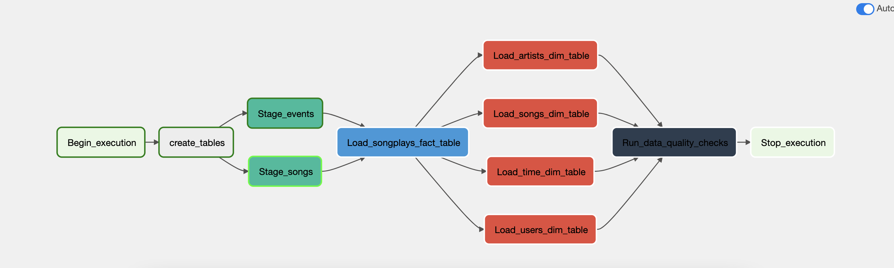
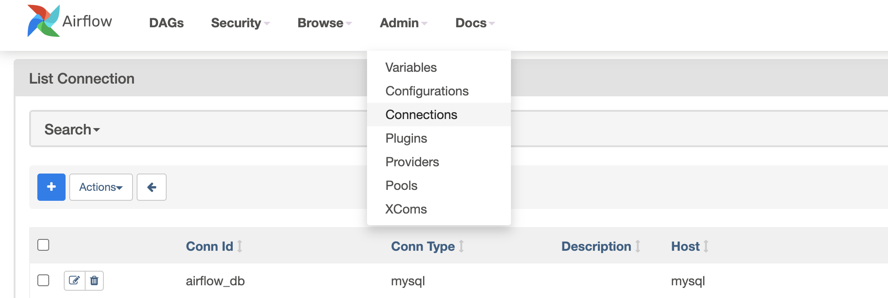
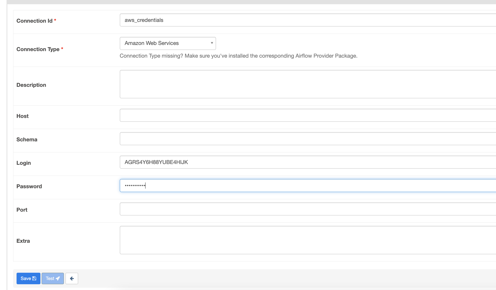
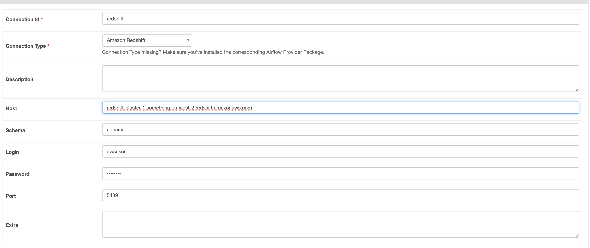

# Data Pipelines with Airflow
## Project Description
A music streaming company, Sparkify, has decided that it is time to introduce more automation and monitoring to their data warehouse ETL pipelines and come to the conclusion that the best tool to achieve this is Apache Airflow.

Here a data pipeline is implemented using Apache Airflow that loads data from S3 to Redshift. In addition to that tests are run against the dataset to guarantee quality of the data.

## Pipeline
The pipeline extracts the data from S3 transforms it and loads it into Redshift. See the dag below.
### Dag

### Original S3 Data
The data is distributed over two datasets that reside in S3. Here are the S3 links for each:

Song data: `s3://udacity-dend/song_data`
Log data: `s3://udacity-dend/log_data`

Log data json path: `s3://udacity-dend/log_json_path.json`

### Redshift Database
For this project a star schema is created to optimize for on song play analysis. The benefits of using star schema is for instance simpler queries and good query performance. Both of which are preferrable here. The database consists of one fact table and four dimensional tables.

- artist (dimensional)
- songplay (fact)
- songs (dimensional)
- time (dimensional)
- users (dimensional)

## How to run
Here we used python 3.7
```bash
virtualenv -p python37 venv
source venv/bin/activate
pip install -r requirements.txt
airflow db init
airflow standalone
```

### Create Connection
First create connection to get access to S3.

First Create Connection
1. Admin->Connection
2. Click the blue plus icon



3. Set your AWS Access key as login and the secret key as the password.



4. Create another connection for Reshift

   
5. Trigger the dag.